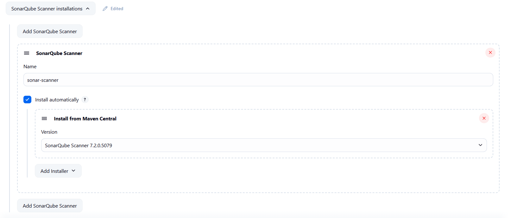
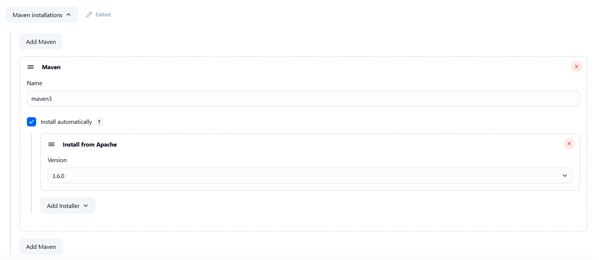
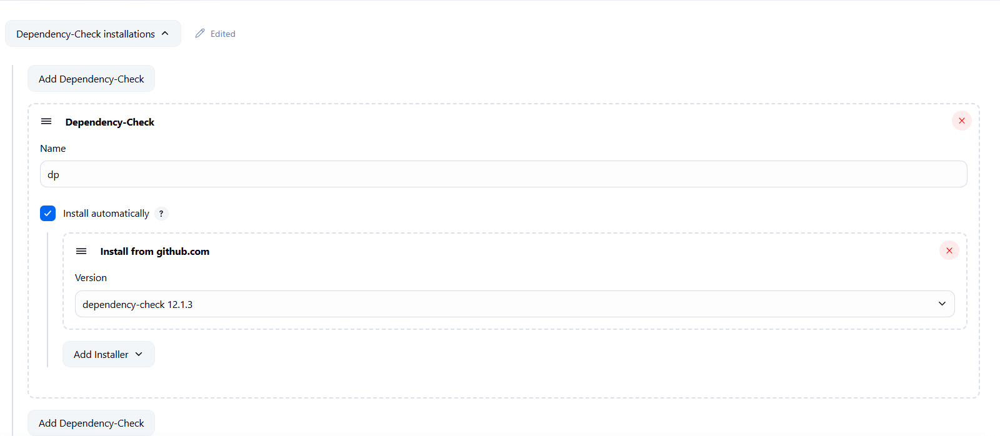
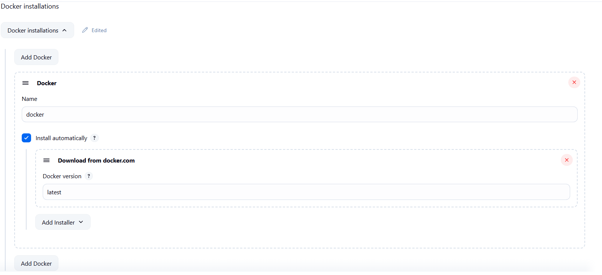

# CI/CD Pipeline With Jenkins

Three tier project create and deploy with CI/CD pipeline using jenkins and also use othe DevOps tools like Docker, SonarQube, Maven, OWASPS, GitHub, AWS EC2.

## Tools Used in this project

Jenkins, GitHub, Docker, SonarQube, Maven, OWASPS, AWS EC2.

## Setup instructions for the project

#### Step 1: Setup AWS EC2 instanace for Jenkins

- Goto AWS console
- instance name: jenkins_server
- Choose Amazon Machine Image(AMI): Ubuntu
- Inatance type: t2-micro
- Create key pair with .pem extension file
- Network > Security Group: Default
- Storage: 15GB
- Click lanuch instanace
- Goto instanaces select instanace and click Connect
- Follow the instructions for SSH and Connect with EC2 instructions using your terminal
- Alternate you can use MobaXtreme or Putty for the EC2 Connection.

#### Step 2: Jenkins setup in EC2

- Update the system first

```
 sudo apt update

```

- Jenkins is build in java language so we need to install jdk first
- You can refer this link for installation also: https://www.jenkins.io/doc/book/installing/

```
sudo apt update
sudo apt install fontconfig openjdk-21-jre
java -version
```

- Install Jenkins Now

```
sudo wget -O /etc/apt/keyrings/jenkins-keyring.asc \
  https://pkg.jenkins.io/debian-stable/jenkins.io-2023.key
echo "deb [signed-by=/etc/apt/keyrings/jenkins-keyring.asc]" \
  https://pkg.jenkins.io/debian-stable binary/ | sudo tee \
  /etc/apt/sources.list.d/jenkins.list > /dev/null
sudo apt-get update
sudo apt-get install jenkins
```

- Check jenkins is start and enable or not using this cmd

```
systemctl status jenkins
```

output:
Enable and active

- If not running start manually

```
systemctl start jenkins
systemctl enable jenkins
```

- Jenkins generally host on port: 8080. <ec2-public-ip>:8080 on webpage
- You can see the jenkins setup
- You need to give the password in starting, the path will provide you, just goto your ec2 instance terminal and run that address using

```
sudo cat <path>
```

- Click install recommanded pluging for jenkins and setup jenkins.

#### Step 3: Create First Job CI_Pipeline

#### Before start CICD pipeline install some plugings for the projects: - settings > plugings > available plugings

    1. Eclipse Temurin installer Plugin
    2. openJDK-native-plugin
    3. SonarQube Scanner for Jenkins
    4. Maven Integration plugin
    5. OWASP Dependency-Check Plugin
    6. CloudBees Docker Build and Publish plugin
    7. Docker Pipeline
    8. Docker plugin
    9. Pipeline: Stage View Plugin

- Now Setup Tool configuration
- Setting > Tools
  
  
  
  
  

- Click on create new Job
- Job name: CI_Pipeline
- Choose Pipeline option below
- Choose discard old builds > Max # of builds to keep: 2
- Scroll down to Pipeline script section and write pipeline code in groovy language as given in project

#### Important steps

- -Dsonar.login=<generate-access-token-docker-hub>\ -------> here generate Access tocken from DockerHub and use that password here
- dependencyCheck additionalArguments: '--scan ./ --nvdApiKey=<your-nvd-api-key> ---------> Search on Web page for generate nvdApiKey for jenkins you get the details, you have to fill the form and they provide the key on your gmail.
- For generating script in 'Build & Push Docker Image' stage click on pipeline syntax
  
- Here add registry credential > you have to create credential click on add and create
- docker installation: Docker ---(not default)

- Click on apply and save

#### Step 4: Create CD_Pipeline

- Create new job name : CD_Pipeline
- select pipeline option
- Scroll down to script section and create CD_pipeline as given here
  
- Create Docker script same as above or copy from there

#### Step 5: Start job pipeline

- Goto CI_Pipeline and click on Build Now initially it takes time
- Now you can access your shopping cart website using <ec2-public-ip>:8070

## Project complete : see you soon in next project.

## Authors

- [@parthGohel](https://github.com/GhlParth)
